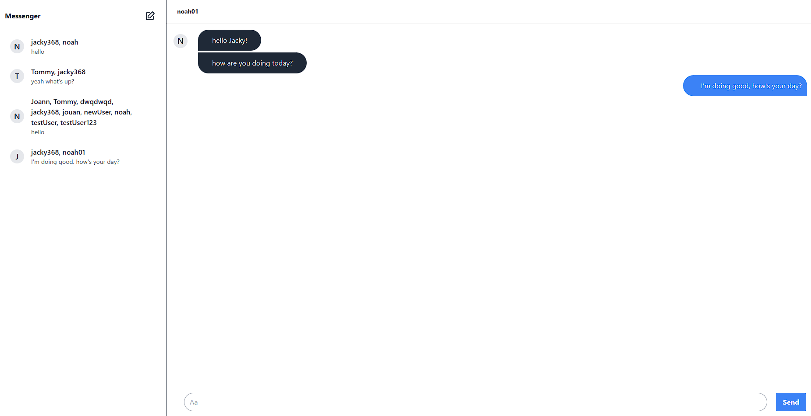

<!-- PROJECT LOGO -->
<br />
<div id="readme-top" align="center">
  <h1 align="center">Full Stack Chat App</h1>

  <p align="center">
    A simple chat app to quickly connect with your friends!
    <br />
    <a href="https://chat-app-zs9s.onrender.com/">View Demo</a>
  </p>
</div>

<!-- TABLE OF CONTENTS -->
<details>
  <summary>Table of Contents</summary>
  <ol>
    <li>
      <a href="#about-the-project">About The Project</a>
      <ul>
        <li><a href="#built-with">Built With</a></li>
      </ul>
    </li>
    <li>
      <a href="#getting-started">Getting Started</a>
      <ul>
        <li><a href="#prerequisites">Prerequisites</a></li>
        <li><a href="#installation">Installation</a></li>
      </ul>
    </li>
    <li><a href="#contact">Contact</a></li>
  </ol>
</details>


<!-- ABOUT THE PROJECT -->
## About The Project

<!--  -->
</br>
</br>
<div align="center">
    
</div>
</br>
</br>

This was a project I built to gain efficiency in widely-used librairies Bcrypt and JWT for supporting Oauth2.0 functionalities and their applications in user registraction and login. 

Initially this project was confined to a simple login page that stored data within a MongoDB database. Subsequently, I expanded its scope by integrating a chat feature. An inherent challenge was establishing real-time synchronization of chat messages across multiple users while preserving chat data. To address this challenge, I studied use cases of Socket.io and developed a way to manage communication flow while storing data in MongoDB.

<p align="right">(<a href="#readme-top">back to top</a>)</p>


### Built With

* React.js
* Redux
* Tailwind.css
* Express.js
* Socket.io
* Bcrypt
* JWT
* MongoDB

<p align="right">(<a href="#readme-top">back to top</a>)</p>


<!-- GETTING STARTED -->
## Getting Started

### Prerequisites

* npm
  ```sh
  npm install npm@latest -g
  ```

### Installation

1. Create a new MongoDB database and have your connection string

2. Clone the repo
   ```sh
   git clone https://github.com/noahchen1/chat-messaging-app.git
   ```
3. Install NPM packages in both the client and the server folders
   ```sh
   npm install
   ```
4. Create a .env file inside the server folder and enter your MongoDB connection string without '
   ```js
   ATLAS_URI='YOUR CONNECTION STRING';
   ```
5. In the client folder, you can run:

    ### `npm start`

    Runs the app in the development mode.\
    Open [http://localhost:3000](http://localhost:3000) to view it in your browser.

    The page will reload when you make changes.\
    You may also see any lint errors in the console.

    ### `npm test`

    Launches the test runner in the interactive watch mode.\
    See the section about [running tests](https://facebook.github.io/create-react-app/docs/running-tests) for more information.

    ### `npm run build`

    Builds the app for production to the `build` folder.\
    It correctly bundles React in production mode and optimizes the build for the best performance.

    The build is minified and the filenames include the hashes.\
    Your app is ready to be deployed!

    See the section about [deployment](https://facebook.github.io/create-react-app/docs/deployment) for more information.

    ### `npm run eject`

    **Note: this is a one-way operation. Once you `eject`, you can't go back!**

    If you aren't satisfied with the build tool and configuration choices, you can `eject` at any time. This command will remove the single build dependency from your project.

    Instead, it will copy all the configuration files and the transitive dependencies (webpack, Babel, ESLint, etc) right into your project so you have full control over them. All of the commands except `eject` will still work, but they will point to the copied scripts so you can tweak them. At this point you're on your own.

    You don't have to ever use `eject`. The curated feature set is suitable for small and middle deployments, and you shouldn't feel obligated to use this feature. However we understand that this tool wouldn't be useful if you couldn't customize it when you are ready for it.

<p align="right">(<a href="#readme-top">back to top</a>)</p>

<!-- CONTACT -->
## Contact

Noah Chen - nuoya1996@gmail.com

Project Link: [https://github.com/noahchen1/chat-messaging-app.git](https://github.com/noahchen1/chat-messaging-app.git)

<p align="right">(<a href="#readme-top">back to top</a>)</p>